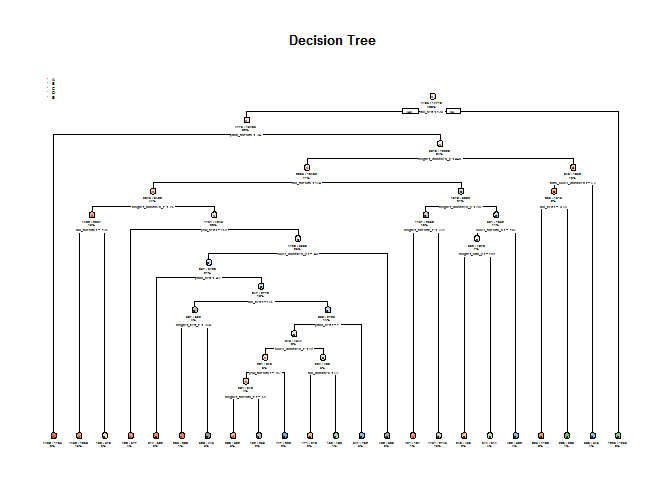
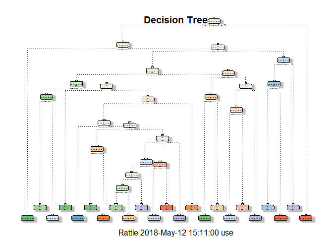

### Target Summary

In this project is Using devices such as Jawbone Up, Nike FuelBand, and
Fitbit it is now possible to collect a large amount of data about
personal activity relatively inexpensively. These type of devices are
part of the quantified self movement - a group of enthusiasts who take
measurements about themselves regularly to improve their health, to find
patterns in their behavior, or because they are tech geeks. One thing
that people regularly do is quantify how much of a particular activity
they do, but they rarely quantify how well they do it.

In this project, your goal will be to use data from accelerometers on
the belt, forearm, arm, and dumbell of 6 participants. They were asked
to perform barbell lifts correctly and incorrectly in 5 different ways.
More information is available from the website here:
<http://groupware.les.inf.puc-rio.br/har>

Note: The data for this project come from this source:
<http://groupware.les.inf.puc-rio.br/har>.

##### Libraries used in this project

    library(caret)

    ## Loading required package: lattice

    ## Loading required package: ggplot2

    library(rpart)
    library(rpart.plot)
    library(RColorBrewer)
    library(rattle)

    ## Rattle: A free graphical interface for data science with R.
    ## Version 5.1.0 Copyright (c) 2006-2017 Togaware Pty Ltd.
    ## Type 'rattle()' to shake, rattle, and roll your data.

    library(randomForest)

    ## randomForest 4.6-14

    ## Type rfNews() to see new features/changes/bug fixes.

    ## 
    ## Attaching package: 'randomForest'

    ## The following object is masked from 'package:rattle':
    ## 
    ##     importance

    ## The following object is masked from 'package:ggplot2':
    ## 
    ##     margin

### Loading data sets

    setwd("C:/Users/use/Documents/cat")

    training <- read.csv("pml-training.csv",na.strings=c("NA","#DIV/0!", ""))

{r, echo=FALSE} dim ( training ) \`\`\`

    testing <- read.csv("pml-testing.csv",na.strings=c("NA","#DIV/0!", ""))

{r, echo=FALSE} dim ( testing )

    #The training set consists of 19622 observations of 160 variables
    #The testing set consists of 20 observations of 160 variables

-The training set consists of 19622 observations of 160 variables

-The testing set consists of 20 observations of 160 variables

### Cleaning data

Columns in the orignal training and testing datasets that are mostly
filled with missing values are then removed count the number of missing
values in each column of the full training dataset

    training <-training[,colSums(is.na(training)) == 0]
    testing <-testing[,colSums(is.na(testing)) == 0]

    training   <-training[,-c(1:7)]
    testing <-testing[,-c(1:7)]

    dim ( training ) 

    ## [1] 19622    53

    dim ( testing  )

    ## [1] 20 53

### zero variance predictors

Diagnoses predictors that have one unique value (i.e. are zero variance
predictors) or predictors that are have both of the following
characteristics

    ColumnsZVar <- nearZeroVar(training, saveMetrics = TRUE)
    training <- training[, ColumnsZVar$nzv==FALSE]
    training$classe = factor(training$classe)

Partitioning the training data This validation dataset will allow us to
perform cross validation when developing our model.

### Partitioning the training data set to allow cross-validation

    set.seed(1234)
    subTrain <- createDataPartition(y=training$classe, p=.75, list=FALSE)

    TheTraining <- training[subTrain, ]
    TheTesting <- training[-subTrain, ]

Ddataset contains 59 variables, with the last column containing the
'class' variable we are trying to predict.

### Modelprediction 1 : Using Decision Tree

    modelDT <- rpart(classe ~ ., data=TheTraining, method="class")

    predictionDT <- predict(modelDT, TheTesting, type ="class")

### Plot of the Decision Tree

    rpart.plot(modelDT, main="Decision Tree ", extra=102, under=TRUE, faclen=0)

    fancyRpartPlot (modelDT, main="Decision Tree")

### Test results on our subTesting data set:

    confusionMatrix(predictionDT,TheTesting$classe)

    ## Confusion Matrix and Statistics
    ## 
    ##           Reference
    ## Prediction    A    B    C    D    E
    ##          A 1235  157   16   50   20
    ##          B   55  568   73   80  102
    ##          C   44  125  690  118  116
    ##          D   41   64   50  508   38
    ##          E   20   35   26   48  625
    ## 
    ## Overall Statistics
    ##                                           
    ##                Accuracy : 0.7394          
    ##                  95% CI : (0.7269, 0.7516)
    ##     No Information Rate : 0.2845          
    ##     P-Value [Acc > NIR] : < 2.2e-16       
    ##                                           
    ##                   Kappa : 0.6697          
    ##  Mcnemar's Test P-Value : < 2.2e-16       
    ## 
    ## Statistics by Class:
    ## 
    ##                      Class: A Class: B Class: C Class: D Class: E
    ## Sensitivity            0.8853   0.5985   0.8070   0.6318   0.6937
    ## Specificity            0.9307   0.9216   0.9005   0.9529   0.9678
    ## Pos Pred Value         0.8356   0.6469   0.6313   0.7247   0.8289
    ## Neg Pred Value         0.9533   0.9054   0.9567   0.9296   0.9335
    ## Prevalence             0.2845   0.1935   0.1743   0.1639   0.1837
    ## Detection Rate         0.2518   0.1158   0.1407   0.1036   0.1274
    ## Detection Prevalence   0.3014   0.1790   0.2229   0.1429   0.1538
    ## Balanced Accuracy      0.9080   0.7601   0.8537   0.7924   0.8307

The Confusion Matrix achieved 0.7394 % accuracy. Here, the 95% CI :
(0.7269, 0.7516). The Kappa statistic of 0.6697 reflects the
out-of-sample error. For the above values is necessary to use the method
toRandom Forest Model determineis much better estimator and predictor.

Applied the Random Forest Model and it has shown significant amount of
accuracy in prediction.

### Modelprediction 2 : Using Random Forest

    modelRF <- randomForest(classe ~. , data=TheTraining, method="class")
    print (modelRF)

    ## 
    ## Call:
    ##  randomForest(formula = classe ~ ., data = TheTraining, method = "class") 
    ##                Type of random forest: classification
    ##                      Number of trees: 500
    ## No. of variables tried at each split: 7
    ## 
    ##         OOB estimate of  error rate: 0.46%
    ## Confusion matrix:
    ##      A    B    C    D    E  class.error
    ## A 4182    3    0    0    0 0.0007168459
    ## B   13 2831    4    0    0 0.0059691011
    ## C    0   14 2550    3    0 0.0066225166
    ## D    0    0   19 2390    3 0.0091210614
    ## E    0    1    2    5 2698 0.0029563932

### Predicting:

    predictionRF <- predict(modelRF, TheTesting, type = "class")

### Test results on subTesting data set:

    confusionMatrix(predictionRF, TheTesting$classe)

    ## Confusion Matrix and Statistics
    ## 
    ##           Reference
    ## Prediction    A    B    C    D    E
    ##          A 1395    3    0    0    0
    ##          B    0  943   10    0    0
    ##          C    0    3  844    5    0
    ##          D    0    0    1  799    0
    ##          E    0    0    0    0  901
    ## 
    ## Overall Statistics
    ##                                           
    ##                Accuracy : 0.9955          
    ##                  95% CI : (0.9932, 0.9972)
    ##     No Information Rate : 0.2845          
    ##     P-Value [Acc > NIR] : < 2.2e-16       
    ##                                           
    ##                   Kappa : 0.9943          
    ##  Mcnemar's Test P-Value : NA              
    ## 
    ## Statistics by Class:
    ## 
    ##                      Class: A Class: B Class: C Class: D Class: E
    ## Sensitivity            1.0000   0.9937   0.9871   0.9938   1.0000
    ## Specificity            0.9991   0.9975   0.9980   0.9998   1.0000
    ## Pos Pred Value         0.9979   0.9895   0.9906   0.9988   1.0000
    ## Neg Pred Value         1.0000   0.9985   0.9973   0.9988   1.0000
    ## Prevalence             0.2845   0.1935   0.1743   0.1639   0.1837
    ## Detection Rate         0.2845   0.1923   0.1721   0.1629   0.1837
    ## Detection Prevalence   0.2851   0.1943   0.1737   0.1631   0.1837
    ## Balanced Accuracy      0.9996   0.9956   0.9926   0.9968   1.0000

The Confusion Matrix achieved 99.51% accuracy.in the 95% CI : (0.9927,
0.9969) and the OOB (Out-Of-Bag) Error Rate is 0.43%.The Kappa statistic
of 0.9938 reflects the out-of-sample error

### Decision

As expected, Random Forest algorithm performed better than Decision
Trees. Accuracy for Random Forest model was Accuracy : 0.9951 and (95%
CI: ((0.9927, 0.9969))) compared to 95% CI : (0.7269, 0.7516) for
Decision Tree model. The random Forest model is choosen. The accuracy of
the model is 0.995. The expected out-of-sample error is estimated at
0.005, or 0.5%. The expected out-of-sample error is calculated as 1 -
accuracy for predictions made against the cross-validation set. Our Test
data set comprises 20 cases. With an accuracy above 99% on our
cross-validation data, we can expect that very few, or none, of the test
samples will be missclassified.

### Conclusion

Of the two Prediction Methods used in the study, accuracy was better for
the The Random Forest method since the Confusion Matrix achieves
approximately only. The random forest clearly performs better,
approaching 99% accuracy for in-sample and out-of-sample error so we
will select this model and apply it to the test data set. We use the
provided function to classify 20 data points from the test set by the
type of lift. We then upload these classifications to Coursera to
confirm that the model is working correctly.

### Submission

    answers<- as.vector(predictionRF[1:20])
    pml_write_files  =  function ( x ) { 
      n  =  length ( x ) 
      for ( i  in  1 : n ) { 
        filename  =  paste0 ( "problem_id_" , i , ".txt" ) 
        write.table ( x [ i ] , file = filename , quote = FALSE , row.names = FALSE , col.names = FALSE ) 
      } 
    }

    pml_write_files ( answers )
